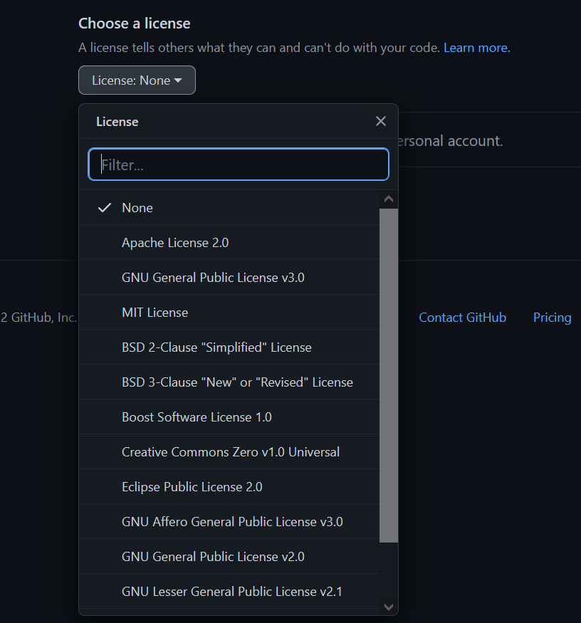

# Basic GitHub guide

To work with GitHub you need a GitHub account, after that you can have repositories, you can create it from zero
or going to an existing repository from any user and make a fork.

## Terminology clarification

- Git: software for tracking changes in any set of files, usually used for coordinating work among programmers collaboratively developing source code during software development.
- Repo or repository: It's a digital storage for any type of content, it can be local (in your computer) or remote (in another computer or server)
- Fork: A fork is a copy of a repository. Forking a repository allows you to freely experiment with changes without affecting the original project.
- Pull request: A pull request is an event in Git where a contributor asks a maintainer of a Git repository to review code they want to merge into a project

## How to add a repository in GitHub

To add a repo we have to log in and in the main
page we have to click in the green button called __New__.

### Create new repo

To create a new repo we have to:

1. select the owner (only if we are in an organization) and give it a name (whichever we want)

2. Give it a description (optional)

3. Select if is public (anyone can see the code and it's updates but can't do anything without you permission) or private (only accessible for users you allow)

4. Select if we want to add a README (file that will be used as a presentation of our repo with content introduction and how to collaborate with us and/or repo usage information)

5. Select if you want to add a .gitignore (Creates the file based in templates, and you can choose it depending on your needs)

(In this file all the content it has refers to the project files and directories that don't be tracked by git the version control)
6. Choose the license (Basically to add legal restrictions on the code for all people you included)

7. Finally click on __Create repository__

### Import method

To make the import we need to:

1. In the create repository page click on __Import a repository__

2. Paste the repository URL

3. Select the owner (if we are in an organization) and Give it a name (whichever we want)

4. select the privacy

5. Click in __begin import__ button and wait it finish the job

6. import complete

(You don't need to keep open the window for this part, when the process completes you'll receive an email)

### Create a repo from a fork

This method allows you to work with the code and when you make changes on the repo lets you make a pull request to send
a code integration petition to the forked repository and if the original repo is ahead of yours lets you update it and be in the same commit.

To fork a repo you have to:

1. Go to the repo you want and click on fork button

2. Select the owner and repo name (like in the normal way), add a description and click on __Create fork__

