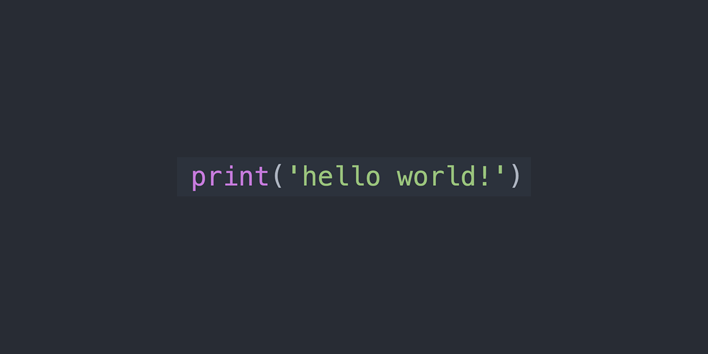

# Markdown Guidelines

## Table of Contents

- [General Structure](#general-structure)
- [Examples](#examples)
  - [Code Snippets](#code-snippets)
  - [Blockquotes](#blockquotes)
  - [Mixing Examples](#mixing-examples)
- [Lists](#lists)
  - [Unordered Lists](#unordered-lists)
  - [Ordered Lists](#ordered-lists)
  - [Nested Lists](#nested-lists)
- [Hyperlinks](#hyperlinks)
- [Tables](#tables)
- [Images](#images)

<!-- end of the list -->

The table of contents should never use numbers (since they won't be shown in the document).

## General Structure

Every markdown document should start with a commented section including layout, title, author and date.

    ---
    layout: default
    title: Markdown Guidelines
    author: BCNGeeks
    date: 20th June 2022
    ---

Sometimes the title and the h1 may enter in conflict. If so erase the title from the commented section.

One and only one h1 should be used to name the whole document, and then several h2 to refer to each section. h3, h4 should be used for nested subsections. Please add a Table of Contents for easy navigation.

Documents should be written in impersonal form. That means they shouldn't refer to "you" or "me".

The *look* of your markdown document should be taken into account. It won't be shown in the final result, but both the markdown document and the resulting HTML should be easily readable.

## Examples

### Code Snippets

Use code snippets for your examples! For that indent 4 spaces:

    The <a> tag should only by used for hyperlinks.

You can also do small code snippets using the ` character. 

For example: The `<a>` tag should only be used for hyperlinks.

### Blockquotes

You can also use blockquotes by using the character `>` but do not use it for code. All text in a blockquote will be rendered as normal but contained in a box. Blockquotes should be reserved for highlighted paragraphs of normal text.

#### _Markdown Code:_

    > Very important:
    >
    > Never use `
` again! It's obsolete!

#### _Result:_

> Very important:
>
> Never use `
` again! It's obsolete!

### Mixing Examples

You can also mix both blockquotes and code snippets but we don't recommend such practice unless completely needed; the final style will not look great. Take into account that to mix these two you need to intend 5 spaces instead of 4.

#### _Markdown Code:_

    > This is a much better alternative:
    >
    >     <h2 style="text-align: center">
    >       CSS center property
    >     </h2>>

#### _Result:_

> This is a much better alternative:
>
>     <h2 style="text-align: center">
>       CSS center property
>     </h2>>

## Lists

There are two kind of lists: ordered or unordered. Please use them accordingly, sorting only a series of consecutive steps causally connected.

Sometimes lists like to misbehave so adding a `<!-- end of the list -->` at the end of them prevents any problems.

### Unordered Lists

#### _Markdown Code:_

    There are different kind of selectors in HTML:

    - id: must be unique
    - name: must be unique
        - id and name have different properties in `<form>`
    - class: can be repeated

    <!-- end of the list -->

#### _Result:_

There are different kind of selectors in HTML:

- id: must be unique
- name: must be unique
    - id and name have different properties in `<form>`
- class: can be repeated

<!-- end of the list -->

Please take into account that both `-` and `*` will result in the same list but `*` is also reserved for **bold** and *italics*.

### Ordered Lists

#### _Markdown Code:_

    To do a tortilla de patatas you will need potatoes, eggs and onion.

    1. First peel the potatoes and fry them.
    2. Then fry the onion.
    3. Finally merge everything with the eggs.

    <!-- end of the list -->

#### _Result:_

To do a tortilla de patatas you will need both potatoes, eggs and onion.

1. First peel the potatoes and fry them.
2. Then fry the onion.
3. Finally merge everything with the eggs.

<!-- end of the list -->

### Nested Lists

Making nested lists is easy. Only problem is that there is only 2 indexes: either numbers or unordered lists (as previously shown). So to prevent confusion we recommend that all sublists be unordered.

#### _Markdown Code:_

    1.  List item one.

        List item one continued with a second paragraph followed by an
        Indented block.

            $ ls *.sh
            $ mv *.sh ~/tmp
    
        List item continued with a third paragraph.
    
    2.  List item two continued with an open block.
    
        This paragraph is part of the preceding list item.
    
        -  This list is nested and does not require explicit item continuation.

            This paragraph is part of the preceding list item.
 
        -  List item b.

        This paragraph belongs to item two of the outer list.
        
    <!-- end of the list -->

#### _Result:_

1.  List item one.

    List item one continued with a second paragraph followed by an
    Indented block.

        $ ls *.sh
        $ mv *.sh ~/tmp

    List item continued with a third paragraph.

2.  List item two continued with an open block.

    This paragraph is part of the preceding list item.

    -  This list is nested and does not require explicit item continuation.

        This paragraph is part of the preceding list item.

    -  List item b.

    This paragraph belongs to item two of the outer list.

<!-- end of the list -->

---

If you really need roman indeces (or any other kind) you will have to work with HTML:

#### _Markdown Code:_

    <ol type="I">
      <li>List 1</li>
      <li>List 2</li>
      <li>List 3</li>
    </ol>

#### _Result:_

<ol type="I">
  <li>List 1</li>
  <li>List 2</li>
  <li>List 3</li>
</ol>

## Hyperlinks

If you do any reference to external concepts please use hyperlinks for easier navigation. For that use a relative path to your same folder AND make the extension an .md since your markdowns will be converted to that.

#### _Markdown Code:_

    [This same page](./MarkdownGuidelines.md)
    
    [List Section](./MarkdownGuidelines.md#lists)

#### _Result:_

[This same page](./MarkdownGuidelines.md)

[List Section](./MarkdownGuidelines.md#lists)

## Tables

Your tables should be readable both in the original markdown and the final HTML. Tables will always have one and only one table header (which will be the first row), followed by one and only one row of `----------` where you can indicate alignment with `:`, followed by as many normal rows as you need.

#### _Markdown Code:_

    | Left Align | Center Align | Right Align |
    |:-----------|:------------:|------------:|
    | Monday     |      20      |       Online|
    | Tuesday    |      21      |       Online|
    | Wednesday  |      22      |       Online|
    | Thursday   |      23      |       Office|
    | Friday     |      24      |      No work|

#### _Result:_

| Left Align | Center Align | Right Align |
|:-----------|:------------:|------------:|
| Monday     |      20      |       Online|
| Tuesday    |      21      |       Online|
| Wednesday  |      22      |       Online|
| Thursday   |      23      |       Office|
| Friday     |      24      |      No work|

## Images

The use of images for easy visualization is strongly recommended. For that the images should be grouped in an `img` folder.

#### _Markdown Code:_

    

#### _Result:_

