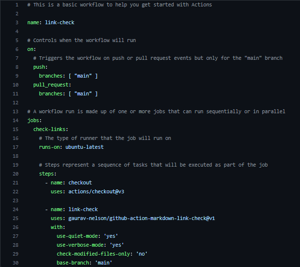

# Triggers Explanation

## Table of Contents  

- [How does triggers work](#how-does-triggers-work)  
- [Differences between Pipeline and workflow](#diferences-between-pipeline-and-workflow)  
- [CI/CD Pipelines](#cicd-pipelines)

## How does triggers work  

Each trigger has a pipeline or workflow that executes an action in the desired field.
The main function is to keep the Continuous integration up to date in order to help all developers working copies to a shared mainline several times a day.  

In our project we currently have a trigger that checks if the input link is operative, if the link is not operative then the merge it would not happen.  

> This is our trigger example.

## Differences between Pipeline and Workflow  

A **pipeline** is a series of processes, usually linear, which filter or transform data. The processes are generally assumed to be running concurrently. The data flow diagram of a pipeline does not normally branch or loop.
The first process takes raw data as input, does something to it, then sends its results to the second process, and so on, eventually ending with the final result being produced by the last process in the pipeline.
Pipelines are normally quick, with a flow taking seconds to hours for end-to-end processing of a single set of data.

A **workflow** is a set of processes, usually non-linear, often human rather than machine, which filter or transform data, often triggering external events. The processes are not assumed to be running concurrently. The data flow diagram of a pipeline can branch or loop.
There may be no clearly defined "first" process -- data may enter the workflow from multiple sources. Any process may take raw data as input, do something to it, then send its results to another process.
There may be no single "final result" from a single process; rather, multiple processes might deliver results to multiple recipients. Workflows can be complex and long-lived; a single flow may take days, months, or even years to execute.

## CI/CD Pipelines  

Developers, in order to share their application source code, will use an SCM system like GitHub, Git, AzureRepo etc., creating the CI Pipeline or build. From this we create a build pipeline. The goal is to compile the application by creating an application package in formats like DDL file.
Following this, the next step would be the release, deploying the application onto a web server. All of these helps the developers and the project to keep in continuous integration, making commits and having automation tests in order to keep software quickly and efficiently.

> This would be how CI/CD is implemented.

