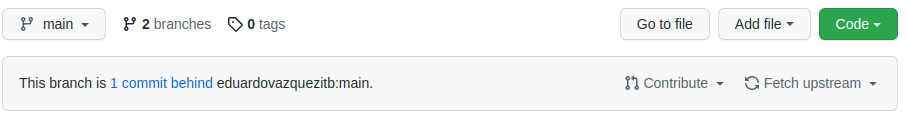

# What happens if my github project is not up to date?

First of all, you can tell that your project is not up to date because the github project will warn you in the main page. If you click on `1 commit behind` you will be able to Pull Request your own project so that it is up to date.

Otherwise, if you continue editing your local project (remember to use a different branch!) your commits will be added to your github project while still behind the original project:

While it's ideal to prevent this situation, if you click on `3 commits ahead` you can still create a Pull Request to the main project. Then the maintainer will have to compare the conflicts and merge.

If there are too many conflicts it is possible that the project is immediately rejected. If on the other hand the edits concern different files it is easy to merge.
