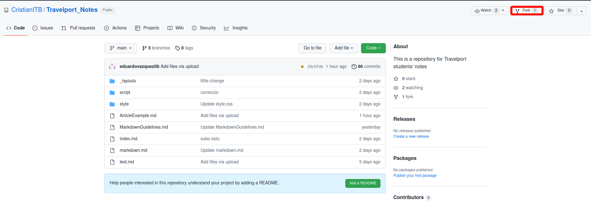
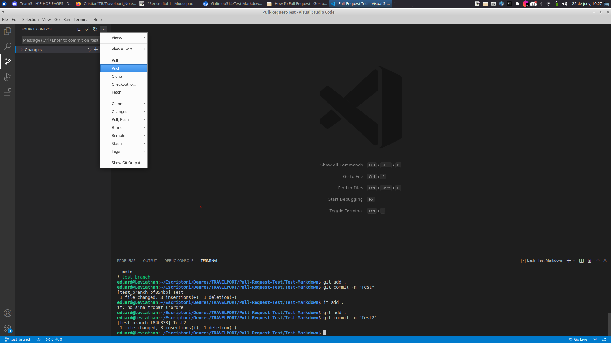
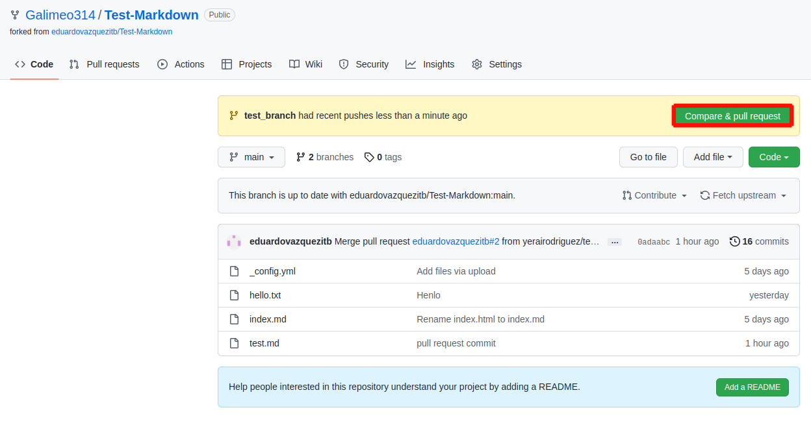
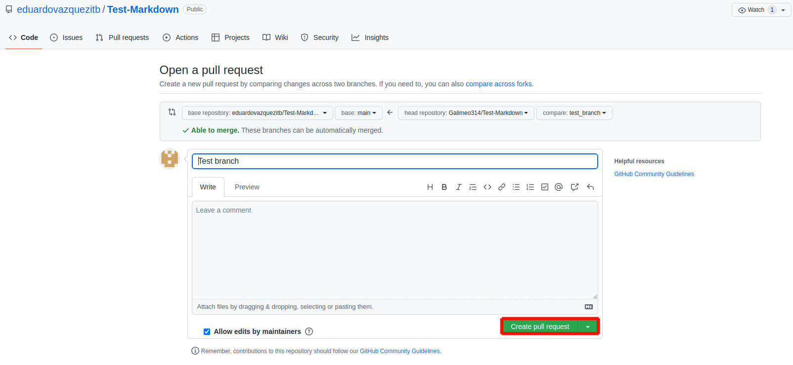

# How To Pull Request

1. Do a Fork of the original project.

    This will create a copy of the project under your possession. It is your responsability to keep that project up to date.

    - **WHAT HAPPENS IF THE PROJECT IS NOT UP TO DATE?**

    

2. Clone the project in your machine. 

        git clone `https://github.com/<YourUserName>/<ProjectName>`

3. Create a new branch where you will do the changes.

    **WHAT HAPPENS IF YOU DON'T CREATE A NEW BRANCH?**

        git checkout -b new_branch
    
4. Do your changes in your local project. Then push it to your own project. You can do this using console or Visual Studio

        git remote add origin `https://github.com/<YourUserName>/<ProjectName>`

        git add .

        git commit -m "BlaBlaBla"

        git push https://<GITHUB_ACCESS_TOKEN>@github.com/<GITHUB_USERNAME>/<REPOSITORY_NAME>.git

5. Go to your Github project and you will find the button "Compare & Pull Request". Click it to request the changes to be pushed into the original project!

