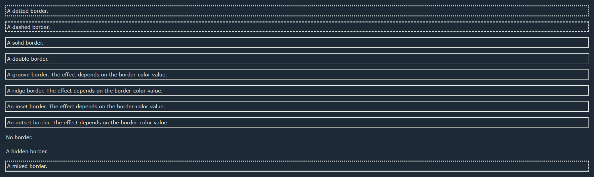

## [INDEX](./index.md)

---

The CSS border property allows to change the style, width , and color of an elements's border.

## BORDER-STYLE

The `border-style` property specifies what kind of border to display.

You can use the next values:

|    Value      |  Description  |
| :-----------: | :----------- |
|   dotted      |     Defines a dotted border      |
|   dashed      |     Defines a dashed border      |
|   solid       |      Defines a solid border      |
|   double      |     Defines a double border      |
|   groove      |    Defines a 3D grooved border. The effect depends on the border-color value      |
|   ridge       |     Defines a 3D ridged border. The effect depends on the border-color value      |
|   inset       |     Defines a 3D inset border. The effect depends on the border-color value      |
|   outset      |     Defines a 3D outset border. The effect depends on the border-color value      |
|   noce        |    Defines no border      |
|   hidden      |      Defines a hidden border      |

### EXAMPLE FOR BORDER-STYLE

```CSS

p.dotted {border-style: dotted;}
p.dashed {border-style: dashed;}
p.solid {border-style: solid;}
p.double {border-style: double;}
p.groove {border-style: groove;}
p.ridge {border-style: ridge;}
p.inset {border-style: inset;}
p.outset {border-style: outset;}
p.none {border-style: none;}
p.hidden {border-style: hidden;}
p.mix {border-style: dotted dashed solid double;}

```



[Try it yourself](https://www.w3schools.com/css/tryit.asp?filename=trycss_border-style)

## BORDER-COLOR

The `border-color` property sets the color of an element's four borders. This property can have from one to four values. Also check the [color](./color.md) page.

[A quick demo!](https://www.w3schools.com/cssref/playdemo.asp?filename=playcss_border-color)

### EXAMPLES FOR BORDER-COLOR

```CSS
div {border-color: #92a8d1;}
```

### BROWSER SUPPORT FOR BORDER-COLOR

| Browser | Version |
|:----:|:-------------|
| Chrome  | 1.0 |
| Explorer  | 4.0 |
| Firefox | 1.0 |
| Safari | 1.0 |
| Opera | 3.5 |

[Try it yourself](https://www.w3schools.com/cssref/tryit.asp?filename=trycss_border-color2)

## BORDER-RADIUS

The `border-radius` property defines the radius of the element's corners.

Tip: This property allows you to add rounded corners to elements!

[A quick demo!](https://www.w3schools.com/cssref/playdemo.asp?filename=playcss_border-radius)

### EXAMPLES FOR BORDER-RADIUS

```CSS
#rcorners1 {
  border-radius: 25px;
  background: #73AD21;
  padding: 20px;
  width: 200px;
  height: 150px;
}
```

[Try it yourself](https://www.w3schools.com/cssref/tryit.asp?filename=trycss3_border-radius2)

### BROWSER SUPPORT FOR BORDER-RADIUS

| Browser | Version |
|:----:|:-------------|
| Chrome  | 5.0 |
| Explorer  | 9.0 |
| Firefox | 4.0 |
| Safari | 5.0 |
| Opera | 10.5 |

## BORDER-WIDTH

The `border-width` property sets the width of an element's four borders.

[A quick demo!](https://www.w3schools.com/cssref/playdemo.asp?filename=playcss_border-width)

### EXAMPLES FOR BORDER-WIDTH

```CSS
div {border-width: medium;}
```

[Try it yourself](https://www.w3schools.com/cssref/tryit.asp?filename=trycss_border-width2)

### BROWSER SUPPORT FOR BORDER-WIDTH

| Browser | Version |
|:----:|:-------------|
| Chrome  | 1.0 |
| Explorer  | 4.0 |
| Firefox | 1.0 |
| Safari | 1.0 |
| Opera | 3.5 |

## BORDER-POSITIONS

You can change an specific part of a border's element just by changing the `border-right` for the right, `border-left` for the left, `border-top` for the top and `border-bottom` for the bottom.

You have sub properties that you can change just by adding -width, -style or -color.

[A quick demo!](https://www.w3schools.com/cssref/playdemo.asp?filename=playcss_border-right)

### BROWSER SUPPORT FOR BORDER-POSITIONS

| Browser | Version |
|:----:|:-------------|
| Chrome  | 1.0 |
| Explorer  | 4.0 |
| Firefox | 1.0 |
| Safari | 1.0 |
| Opera | 3.5 |
