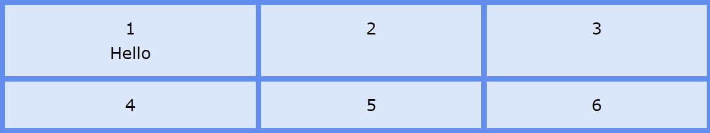
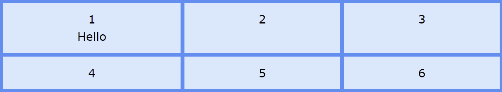

# GRID-AUTO PROPERTIES

## TABLE OF CONTENT

- [GRID-AUTO PROPERTIES](#grid-auto-properties)
  - [TABLE OF CONTENT](#table-of-content)
  - [INDEX](#index)
  - [INTRODUCCTION](#introducction)
  - [GRID-AUTO-COLUMNS PROPERTY](#grid-auto-columns-property)
    - [PROPERTY VALUES](#property-values)
    - [EXAMPLE](#example)
    - [BROWSER SUPPORT](#browser-support)
  - [GRID-AUTO-ROWS PROPERTY](#grid-auto-rows-property)
    - [PROPERTY VALUES](#property-values-1)
    - [EXAMPLE](#example-1)
    - [BORWSER SUPPORT](#borwser-support)
  - [GRID-AUTO-FLOW PROPERTY](#grid-auto-flow-property)
    - [PROPERTY VALUES](#property-values-2)
    - [EXAMPLE](#example-2)
    - [BROWSER SUPPORT](#browser-support-1)

---

## [INDEX](./index.md)

---

## INTRODUCCTION

The grid-auto can be considered another shorthand, this property is for specify a size for the elements, and once put the size that can be in px, percent, em, etc, the elements will be take the same size.

## GRID-AUTO-COLUMNS PROPERTY

This property sets a size for the columns in a grid container.

> This property affects only columns with size not set.

### PROPERTY VALUES

|      Value       | Description                                                                                       |
| :--------------: | :------------------------------------------------------------------------------------------------ |
|       auto       | Is the default value, and the size of the columns will be determined by the size of the container |
|   max-content    | Specifies the size of each column depending of the largest item in the column                     |
|   min-content    | Specifies the size of each column depending of the smallest item in the columns                   |
| minmax(min, max) | Sets a size range greater than or equal to min and less than or equal to max                      |
|      lenght      | Specifies the size of the columns using a lenght value as px, em, etc                             |
|        %         | Specifies the size using a percent value                                                          |

### EXAMPLE

Set the grid-auto-columns with the value `auto`

```CSS
.grid-container{
    grid-auto-columns: auto;
}
```

RESULT


Set the grid-auto-columns with the value `max-content`

```CSS
.grid-container{
    grid-auto-columns: max-content;
}
```

RESULT


Set the grid-auto-columns with the `length` value

```CSS
.grid-container{
    grid-auto-columns: 50px;
}
```

RESULT


Set the grid-auto-columns with `percent` value

```CSS
.grid-container{
    grid-auto-columns: 50px;
}
```

RESULT


### BROWSER SUPPORT

| Browser | Version |
| :-----: | :------ |
| Chrome  | 57      |
|  Edge   | 16      |
| Firefox | 52      |
| Safari  | 10      |
|  Opera  | 44      |

## GRID-AUTO-ROWS PROPERTY

This property sets a size for the rows in a grid container.

> This property affects only rows with size not set.

### PROPERTY VALUES

|    Value    | Description                                                                                        |
| :---------: | :------------------------------------------------------------------------------------------------- |
|    auto     | Is the value for default, and the size of the rows will be determined by the size of the container |
| max-content | Specifies the size of each row depending of the largest item in the column                         |
| min-content | Specifies the size of each row depending of the largest item in the columns                        |
|   lenght    | Specifies the size of the rows using a lenght value as px, em, etc                                 |

### EXAMPLE

Set the grid-auto-rows with the value `auto`.

```CSS
.grid-container{
    grid-auto-rows: auto;
}
```

RESULT



Set the grid-auto-rows with the value `max-content`

```CSS
.grid-container{
    grid-auto-rows: max-content;
}
```

RESULT



Set the grid-auto-rows with a `lenght` value

```CSS
.grid-container{
    grid-auto-rows: 50px;
}
```

RESULT


Set the grid-auto-rows with a `percent` value

```CSS
.grid-container{
    grid-auto-rows: 30%;
}
```

RESULT


### BORWSER SUPPORT

| Browser | Version |
| :-----: | :------ |
| Chrome  | 57      |
|  Edge   | 16      |
| Firefox | 52      |
| Safari  | 10      |
|  Opera  | 44      |

## GRID-AUTO-FLOW PROPERTY

This property specifies how the elements would be inserted the elements in the grid.

### PROPERTY VALUES

|    Value     | Description                                                            |
| :----------: | :--------------------------------------------------------------------- |
|     row      | Places the elements filling each row                                   |
|    column    | Places the elements filling each column                                |
|    dense     | Places the elements necessary for filling the holes in the grid        |
|  row dense   | Places the element by filling each row, and fill any holes in the grid |
| column dense | Places the element by filling each column, and fill any holes in the grid |

### EXAMPLE

Set the grid-auto-flow with the value `row`

```CSS
.grid-container{
    grid-auto-flow: row;
}
```

RESULT


Set the grid-auto-flow with the value `column`

```CSS
.grid-container{
    grid-auto-flow: column;
}
```

RESULT


Set the grid-auto-flow with the value `dense`

```CSS
.grid-container{
    grid-auto-flow: dense;
}
```

RESULT


Set the grid-auto-flow with the value `row dense`

```CSS
.grid-container{
    grid-auto-flow: row dense;
}
```

RESULT


Set the grid-auto-flow with the value `columnd dense`

```CSS
.grid-container{
    grid-auto-flow: column dense;
}
```

RESULT


### BROWSER SUPPORT

| Browser | Version |
| :-----: | :------ |
| Chrome  | 57      |
|  Edge   | 16      |
| Firefox | 52      |
| Safari  | 10      |
|  Opera  | 44      |
